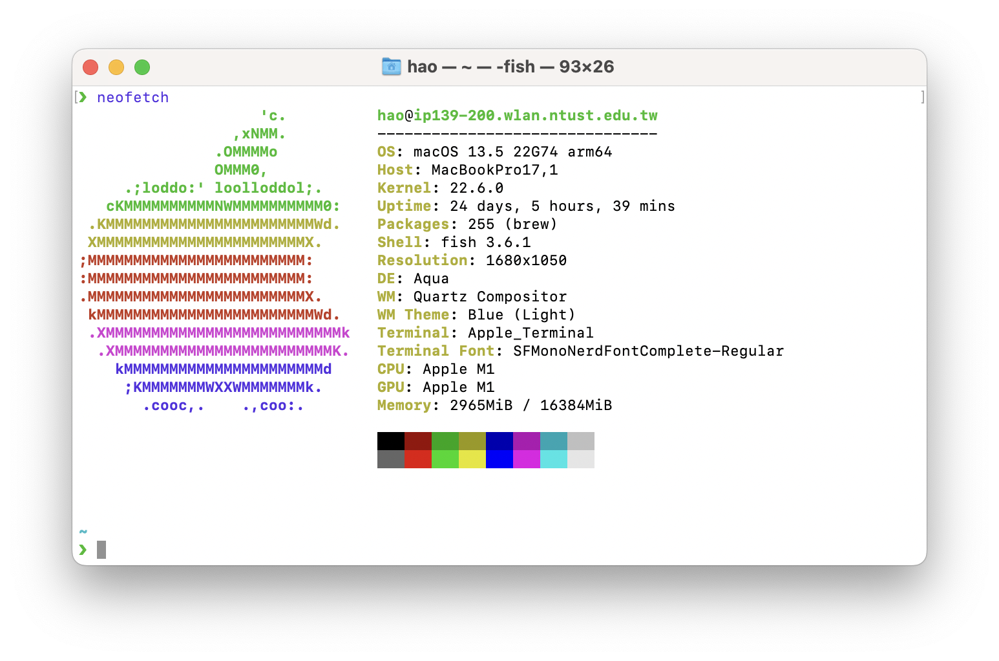
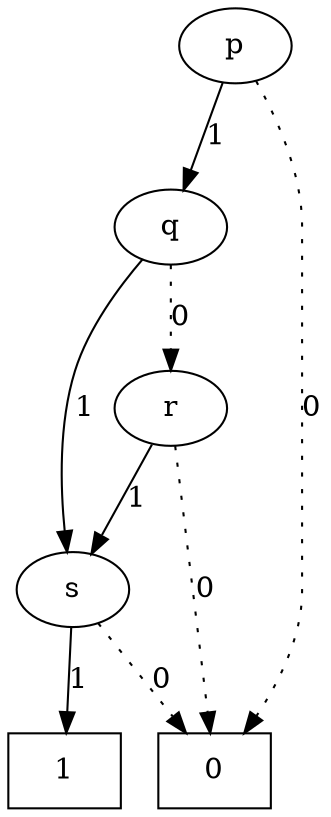
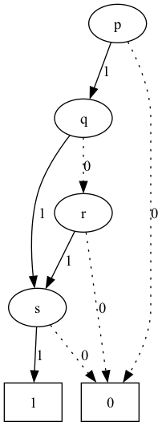
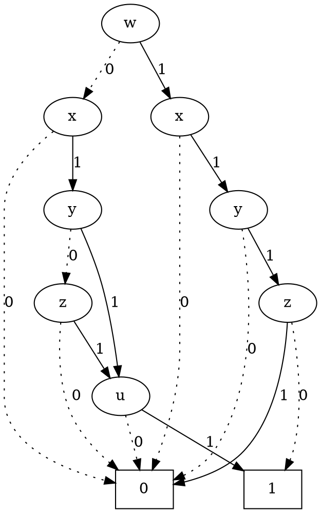
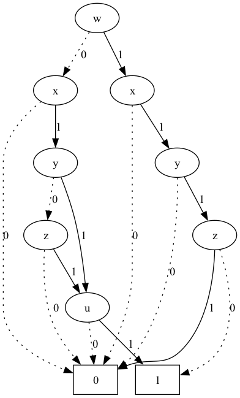

# Project 1 ROBDD Generation

資訊工程系 二年級 乙班 張皓鈞 B11030202


## Build

Use CMake as build tool

```shell
mkdir build
cd build
cmake -DCMAKE_BUILD_TYPE=Release ..
cmake --build .
```


## Test Platform



### macOS

```
Darwin ip139-200.wlan.ntust.edu.tw 22.6.0 Darwin Kernel Version 22.6.0: Wed Jul  5 22:22:52 PDT 2023; root:xnu-8796.141.3~6/RELEASE_ARM64_T8103 arm64
```

### Apple Clang

```
Apple clang version 14.0.3 (clang-1403.0.22.14.1)
```

### Graphviz

```
dot - graphviz version 8.1.0 (20230707.0739)
```


## Test Case

### Case 1 (4 variables)

$$
f(p, q, r, s) = p \land q \land r \land s + p \land q \land \neg r \land s + p \land \neg q \land r \land s
$$

#### Input PLA

[examples/case7/input.pla](../../examples/case7/input.pla)

```pla
.i 4
.o 1
.ilb p q r s
.ob f
.p 3
1111 1
1101 1
1011 1
.e
```

#### Output DOT



#### Generated PNG




### Case 2 (5 variables)

$$
f(w, x, y, z, u) = \neg w \land x \land y \land z \land u + x \land y \land \neg z \land u + \neg w \land x \land \neg y \land z \land u + w \land x \land y \land \neg z \land \neg u
$$

#### Input PLA

[examples/case8/input.pla](../../examples/case8/input.pla)

```pla
.i 5
.o 1
.ilb w x y z u
.ob f
.p 4
01111 1
-1101 1
01011 1
11100 1
.e
```

#### Output DOT



#### Generated PNG

